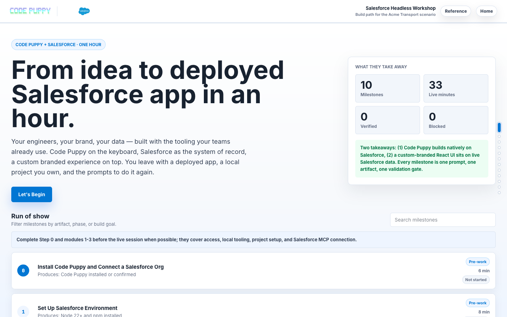
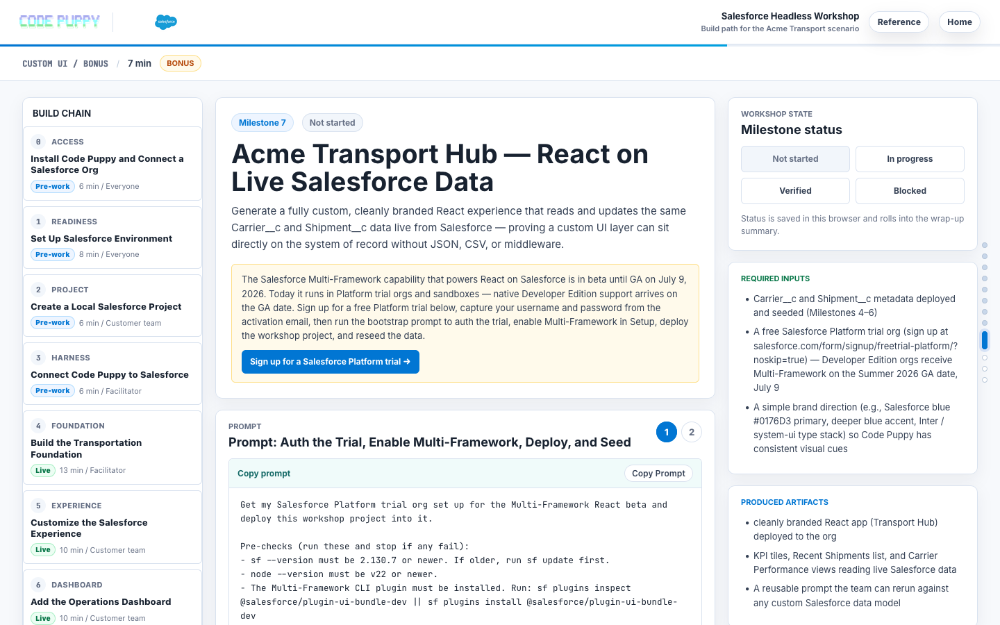

# Salesforce Headless Workshop

> Live-validated, eight-milestone workshop for building React on Salesforce with an agentic coding harness (Code Puppy + Anthropic models).



This is a portfolio-ready, scrubbed version of an enterprise workshop that was developed and live-validated against a Fortune 1 retailer's engineering team in June 2026. It hosts a presenter UI (Vite + React) plus a copy-ready prompt library that walks participants through eight milestones — from local environment readiness all the way to a custom React app deployed onto Salesforce via the Multi-Framework beta, plus a record-triggered Flow that propagates a single Salesforce write to two surfaces with no middleware.

The scenario is **Acme Transport** — a deliberately generic logistics use case (carriers, shipments, exception cases) so the build patterns translate cleanly to whatever vertical your team is working on.

## What you'll build

| # | Mode | Phase | Outcome | Target Time |
|---|---|---|---|---:|
| 0 | Pre-work | Access | Install Code Puppy and connect a Salesforce org | 6 min |
| 1 | Pre-work | Readiness | Verify Node 22+, Salesforce CLI v2.130.7+, skills, and Developer Edition access | 8 min |
| 2 | Pre-work | Project | Create a local Salesforce project | 6 min |
| 3 | Pre-work | Harness | Connect Code Puppy to Salesforce through MCP | 6 min |
| 4 | Live | Foundation | Generate Carrier, Shipment, Case fields, permissions, and seed data | 13 min |
| 5 | Live | Experience | Create the Lightning app shell, tabs, and list views | 10 min |
| 6 | Live | Dashboard | Add the Transportation Operations dashboard and `shipmentTracker` LWC | 10 min |
| 7 | Bonus | Custom UI | Deploy a React **Acme Transport Hub** on the Multi-Framework beta against live Carrier/Shipment data | 7 min |
| 8 | Bonus | Automation | Build a record-triggered Flow that auto-creates an exception Case routed to a queue | 10 min |

The Flow in milestone 8 is the headline demo: one Salesforce write propagates instantly to both the Lightning dashboard from milestone 6 and the React Transport Hub from milestone 7.

Each milestone card carries a copy-ready prompt, expected artifacts, validation commands, and a recovery path.



## What you'll learn

- **Code Puppy harness mechanics** — local agent loop, MCP server bindings, prompt → tool → file flow.
- **Salesforce CLI + skills** — using [`forcedotcom/sf-skills`](https://github.com/forcedotcom/sf-skills) workflows for objects, fields, LWC, FlexiPage, Flow, deploy, and data.
- **Multi-Framework React beta** — scaffolding a UI bundle, deploying via `sf project deploy start`, and reading live Salesforce data through `@salesforce/sdk-data` and the GraphQL UI API.
- **Prompt engineering for build agents** — dry-run guardrails, deploy sanitization, layout idempotency, FLS-before-seed ordering.
- **Platform trial workflow** — the React beta runs in a Salesforce Platform trial today (Developer Edition picks it up at Summer '26 GA on July 9, 2026); the workshop covers signup, `test.salesforce.com` auth, and the one-time Multi-Framework Setup toggle.

## Quickstart

```bash
git clone https://github.com/ejochims/salesforce-headless-workshop-template.git
cd salesforce-headless-workshop-template
npm install
npm run dev
# open http://localhost:3000
```

Then:

1. Open Code Puppy ([install instructions](https://github.com/mpfaffenberger/code_puppy)).
2. Run **Milestone 0 (Preflight)** from the app's prompt library or [`prompts/00-preflight.md`](./prompts/00-preflight.md).
3. Work through the milestones in order. Each ends with a validation gate — paste the Code Puppy output into the workshop UI's status tracker and you'll get an exportable evidence report at the end.

## Tech stack

- React 18 + Vite + TypeScript (workshop microsite)
- Express (production server with optional auth gate)
- Mermaid diagrams + Shiki code highlighting
- Heroku Node.js buildpack (deployable to Heroku as-is via `app.json` + `Procfile`)
- The deployed React-on-Salesforce milestone uses the Salesforce Multi-Framework beta with `@salesforce/sdk-data` + GraphQL UI API

## Adapting for your scenario

The Acme Transport scenario is intentionally generic so the patterns transplant. To rebrand for your own customer or vertical, see [`CUSTOMIZE.md`](./CUSTOMIZE.md). It covers:

- The customer story (carriers/shipments → whatever your domain uses)
- Brand swap (colors, header, app name)
- Permission set + queue API names
- Prompts and validation scripts

## Live deployment

> Coming soon: a public hosted instance at `<your-deployed-url>`. The repo deploys to Heroku without modification — push to a Heroku remote and `npm start` will serve the production build.

## Credits

- [`forcedotcom/sf-skills`](https://github.com/forcedotcom/sf-skills) — official Salesforce coding-agent skill library used throughout the build milestones.
- [`dylandersen/sf-multiframework`](https://github.com/dylandersen/sf-multiframework) — Multi-Framework React beta skill that hardens milestone 7.
- [`mpfaffenberger/code_puppy`](https://github.com/mpfaffenberger/code_puppy) — open-source local coding agent harness used to drive the workshop.

## Repository layout

```text
client/                   Workshop microsite (React + Vite)
server/                   Express server (production auth + static serving)
prompts/                  Source prompt library, one file per milestone
scripts/                  Validation scripts referenced by milestones
labs/                     Post-workshop continuation modules
public/assets/brand/      Visual assets (Code Puppy + Salesforce logos)
docs/screenshots/         README screenshots
force-app/                Empty SFDX shell for the workshop (filled by Code Puppy at runtime)
```

## License

MIT — fork it, use it, rebrand it.
