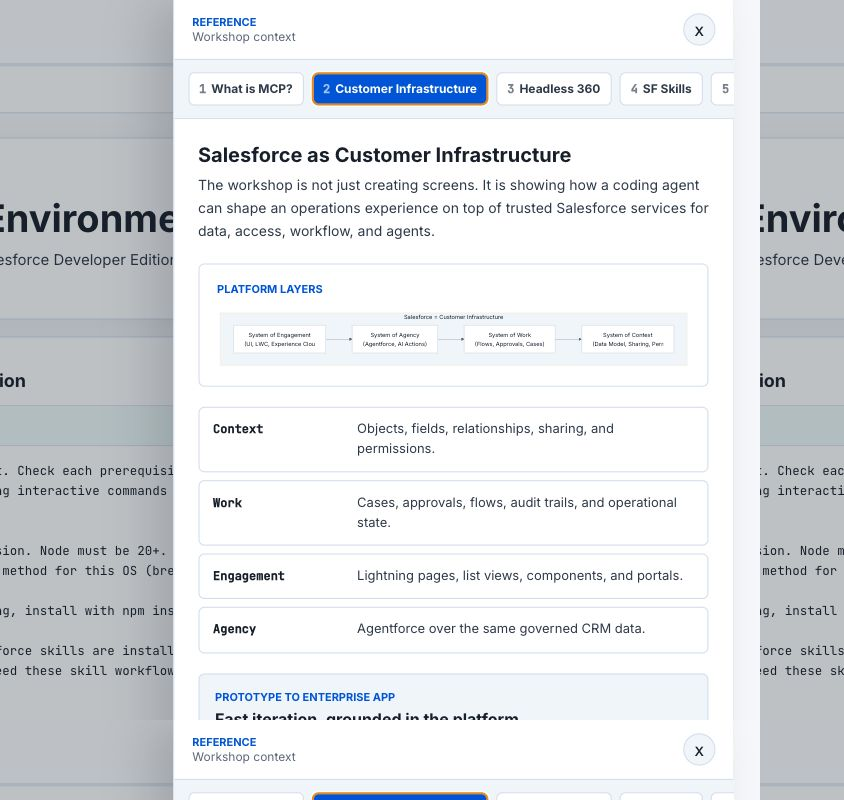

# Salesforce Headless Workshop Template

A portfolio-ready workshop app for showing how account teams can build Salesforce metadata, UI, data, and Agentforce design artifacts from a local agentic coding environment.

The included scenario uses a fictional customer, **Acme Logistics**, so teams can see a complete reference implementation without depending on customer-private materials.

## What This App Shows

- A coding agent can work through Salesforce CLI and MCP instead of requiring users to navigate Salesforce Setup.
- Salesforce metadata can be generated, deployed, validated, and kept as a durable local project.
- A fast prototype can still be grounded in governed CRM services for data, access, workflow, identity, and operational history.
- Participants leave with a reusable build path, not just a demo output.

## Screenshots

Screenshots are stored in `docs/screenshots/`.




## Adapting for Another Customer

This repo is intentionally not a fully generic product framework. It keeps one concrete fictional workshop as the reference implementation and provides a guided path for account teams to adapt the story, branding, Salesforce artifacts, prompts, and validation scripts.

Start with [CUSTOMIZE.md](./CUSTOMIZE.md). It includes discovery questions, a coding-agent adaptation prompt, a find/replace map, file-by-file guidance, and a validation checklist.

## Workshop Flow

The live path is organized into seven milestones:

| # | Phase | Outcome | Target Time |
|---|---|---|---:|
| 1 | Readiness | Verify Node, Salesforce CLI, skills, and Developer Edition access | 8 min |
| 2 | Project | Create a local Salesforce project | 6 min |
| 3 | Harness | Connect a coding agent to Salesforce through MCP | 6 min |
| 4 | Foundation | Build Partner, Delivery, Case fields, permissions, and seed data | 13 min |
| 5 | Experience | Create the Salesforce app, list views, and delivery tracker UI | 10 min |
| 6 | Agent Preview | Draft an Operations Support Assistant Agentforce spec | 4 min |
| 7 | Takeaway | Export evidence and continue toward POC work | 5 min |

Each milestone includes:

- A prompt to paste into a coding agent
- Required inputs and expected artifacts
- Validation criteria
- Recovery commands for common blockers
- A headless strategy lesson for the presenter

## Key Features

- **Presenter-first flow**: Landing page, milestone navigation, status tracking, and wrap-up handoff.
- **Copy-ready prompts**: Workshop prompts live in both the UI and `prompts/`.
- **Reference drawer**: Quick explanations for MCP, Salesforce customer infrastructure, Headless 360, Salesforce skills, and Developer Edition setup.
- **Evidence export**: Wrap-up report generator for milestone status and continuation notes.
- **Production auth gate**: Optional username/password login for hosted deployments.
- **Heroku-ready server**: Express serves the Vite app in production and Vite middleware in development.

## Tech Stack

- React 18
- Vite
- TypeScript
- Express
- Mermaid diagrams
- Shiki code highlighting
- Heroku Node.js buildpack

## Running Locally

Install dependencies:

```bash
npm install
```

Start the development server:

```bash
npm run dev
```

Open:

```text
http://localhost:3000
```

In development, the authentication gate is disabled.

## Building

Create a production build:

```bash
npm run build
```

Run the built app:

```bash
npm start
```

## Production Configuration

The production server enables the login screen only when `NODE_ENV=production` and `SITE_PASSWORD` is set.

Recommended environment variables:

| Variable | Purpose |
|---|---|
| `NODE_ENV=production` | Runs the production server path |
| `PORT` | Provided automatically by Heroku |
| `SITE_USER` | Login username, defaults to `workshop` |
| `SITE_PASSWORD` | Login password; required to enable auth |
| `SESSION_SECRET` | Stable HMAC secret for session cookies |

Do not commit production credentials to this repository.

## Deploying to Heroku

The app includes `app.json` and a `Procfile` for Heroku deployment.

Push the current `main` branch to the Heroku remote:

```bash
git push heroku main
```

Heroku runs:

```bash
npm run build
npm start
```

## Repository Structure

```text
client/
  index.html
  src/
    App.tsx
    components/          Shared UI components
    content/             Milestones, talking points, diagrams, evidence report
    reference/           Reference drawer panels
    sections/            Landing, milestone, and wrap-up sections
    theme.ts             Shared colors and layout constants

server/
  index.ts               Express server, production auth, static serving, Vite dev middleware

prompts/                 Source workshop prompts for each milestone
scripts/                 Validation scripts used during workshop milestones
labs/                    Post-workshop continuation modules
public/assets/brand/     Optional brand assets for adapted workshops
docs/screenshots/        Public screenshots for portfolio review
```

## Workshop Artifacts

The workshop prompts guide participants toward:

- A local Salesforce project
- A connected Salesforce target org
- Partner and Delivery custom metadata
- Standard Case extensions for operations support
- Permission set access for generated assets
- Seed records for partners, deliveries, and cases
- A Lightning app experience
- A delivery tracker Lightning Web Component
- An Agentforce Agent Spec or documented capability blocker
- A continuation path for deployment hardening, UI extensions, and agent work

## Salesforce Build Guardrails

This project follows the workshop rules in `AGENTS.md`:

- Use the default Salesforce target org unless a prompt names another org.
- Keep generated Salesforce metadata under `force-app/main/default/`.
- Prefer deployable metadata over browser-only configuration.
- Validate each milestone before moving to the next one.
- Do not call an Agentforce demo build complete unless deployment, tests, preview, and any available agent test suite succeed.
